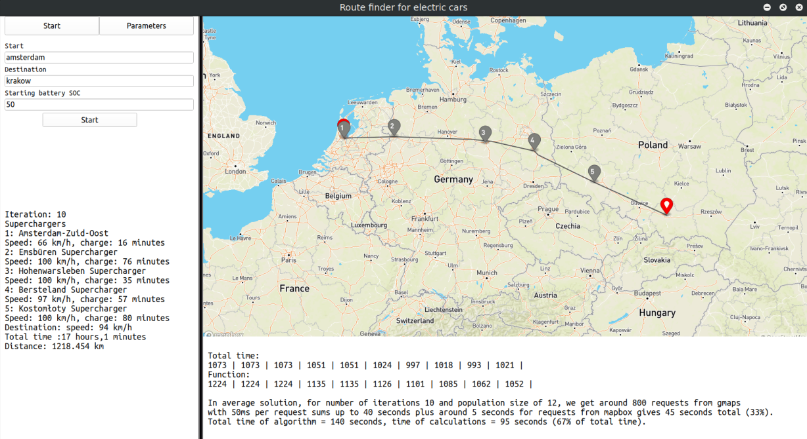

# About

Project solves optimization problem of getting from point A to B by electric car (Tesla S85) using 
only superchargers, in the shortest time possible with usage of evolutionary algorithm.
Outcome of the algorithm is a vector containing: selected charging stations and charging time on each of them
and the proposed average speed with which to move between them and points A and B.

